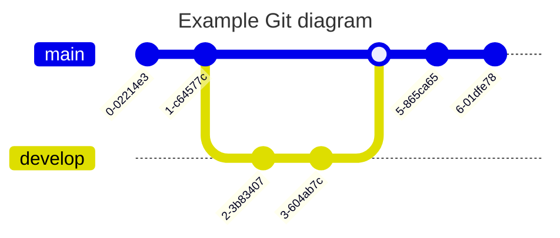

# Welcome to MkDocs

For full documentation visit [mkdocs.org](https://www.mkdocs.org).

## Commands

* `mkdocs new [dir-name]` - Create a new project.
* `mkdocs serve` - Start the live-reloading docs server.
* `mkdocs build` - Build the documentation site.
* `mkdocs -h` - Print help message and exit.

## Project layout

    mkdocs.yml            # The configuration file.
    docs/                 # The folder in with all the docs live
        index.md          # The documentation homepage.
        ...               # Other markdown pages, images and other files.
        subfolder         # Creates a navigation
            some-topic.md # Creates a page with the name 'some topic'

## Material for MkDocs
To have a better theme and quite some nice features we use [Material for MkDoks](https://squidfunk.github.io/mkdocs-material/)

Here is a list of [already included plugins](https://squidfunk.github.io/mkdocs-material/plugins/)

Here are some example [extensions that we could activate](https://squidfunk.github.io/mkdocs-material/reference/admonitions/)

## Here have some mermaid diagrams

The documentation can be found here [Mermaid Diagrams](https://mermaid.js.org/intro/)

### Flowcharts

### Sequence diagram

### Class diagram

### State diagrams

### ER-Diagrams

### Gantt

### Git Graph

### User Journey
