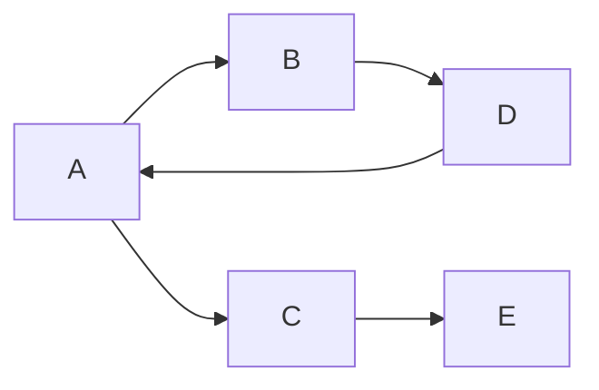

# Information for testing our project

## Configure
- Do this
- copy that
- call this command

## Run
- Do this `bin/bash bla`

## How it works

```mermaid
flowchart LR
    A-->B
    A-->C
    B-->D-->A
    C-->E
```